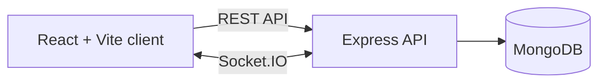

# CodeCampus

**Learn by building, compete with peers, and grow your developer career.**

CodeCampus is an interactive coding education platform with DSA learning, coding practice, real-time battles, mentorship, and career tools.

[Explore features](#features) · [Get started](#get-started) · [Architecture](#architecture) · [API](#api)


<details>
<summary><strong>Contents</strong></summary>

- [Features](#features)
- [Get started](#get-started)
- [Environment variables](#environment-variables)
- [Architecture](#architecture)
- [API](#api)
- [Project layout](#project-layout)

</details>

## Features

<details open>
<summary><strong>Learning and practice</strong></summary>

- DSA roadmap and animated algorithm learning
- Coding IDE and problem practice
- AI learning assistance and voice assistant
- Short-form developer reels and podcasts

</details>

<details>
<summary><strong>Community and careers</strong></summary>

- Coding battles, leagues, and leaderboards
- Student, mentor, recruiter, and admin dashboards
- Collaboration, college contests, and mock interviews
- Recruiter search, portfolio analysis, and developer profiles

</details>

## Get started

### Requirements

- Node.js 22 or later
- npm
- MongoDB for persistent database storage (optional for local startup)

### Install

From the project root, install the frontend and backend dependencies:

```bash
npm install
npm --prefix server install
```

### Configure the backend

Create `server/.env` if you want to configure the API or connect to a MongoDB instance:

```dotenv
PORT=5000
MONGODB_URI=mongodb://127.0.0.1:27017/codecampus
JWT_SECRET=replace-with-a-long-random-secret
```

`MONGODB_URI` defaults to a local MongoDB URL. The server logs a warning and continues if MongoDB cannot be reached. Set a unique, strong `JWT_SECRET` for any shared or deployed environment; the source includes a development fallback.

### Run locally

Start the backend and frontend in separate terminals from the project root:

```bash
npm --prefix server run dev
```

```bash
npm run dev
```

Open the Vite URL shown in the frontend terminal (port `8443` by default). The frontend API client currently targets `http://localhost:5000/api`.

To build the frontend:

```bash
npm run build
```

To seed the database after configuring MongoDB:

```bash
npm --prefix server run seed
```

## Environment variables

| Variable | Used by | Default | Purpose |
| --- | --- | --- | --- |
| `PORT` | Frontend and backend | Frontend: `8443`; backend: `5000` | Development server port |
| `MONGODB_URI` | Backend | `mongodb://127.0.0.1:27017/figma_make_app` | MongoDB connection string |
| `JWT_SECRET` | Backend | Development fallback in source | Signs authentication tokens; configure a strong secret outside local development |

## Architecture



The client uses React Router and Tailwind CSS. The server exposes REST endpoints and Socket.IO events, with Mongoose models for persisted data.

## API

The backend health check is available at `GET /health`. API route groups are mounted under `/api`:

| Route | Area |
| --- | --- |
| `/api/auth` | Registration, login, and current user |
| `/api/problems` | Coding problems and submissions |
| `/api/users` | Profiles, students, and leaderboard |
| `/api/reels` | Developer reels |
| `/api/courses` | Courses |
| `/api/notifications` | Notifications |
| `/api/ai` | AI tutor |

## Project layout

```text
src/                 React application, pages, components, and API client
server/src/          Express API, models, routes, seed data, and sockets
public/              Static assets
```

---

<p align="center">Built for curious minds and competitive coders.</p>